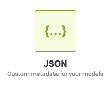
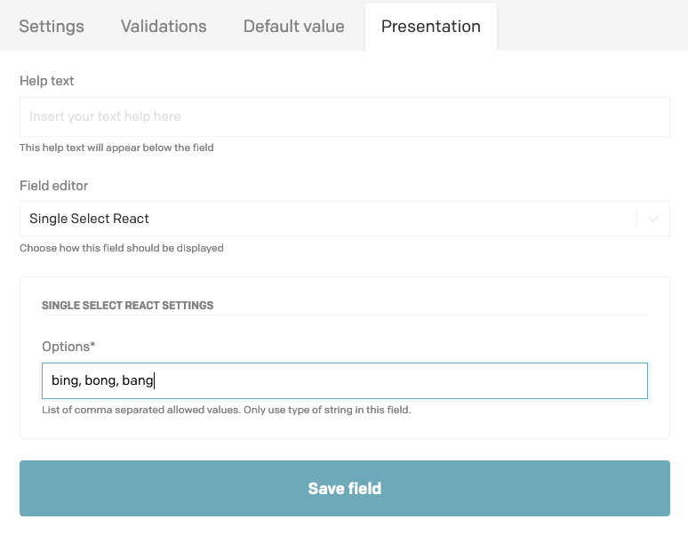
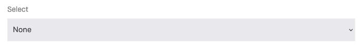
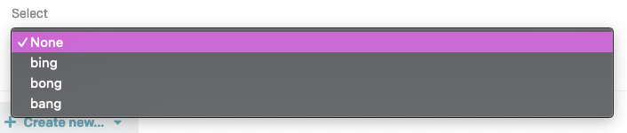
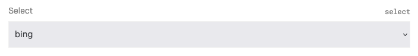

# DatoCMS Single Select React

This plugin is a replacement for the original Single Select available on the DatoCMS Marketplace. 

✍️ Transforms JSON fields of string array type into lists. \
🧑🏻‍💻 React + Typescript. \
✅  Persistence.

### Upcoming in new patch + version: 
💅 New custom styled dropdown. \
💯 Number Types.

After installing this plugin on a JSON field:

- `options`: The type of this has a default of String currently, you can specify \
strings by creating comma separated values. This is done by extending the JSON \
field from Dato and creating a `select` field while mapping your array \
as options within.

### Example: 

